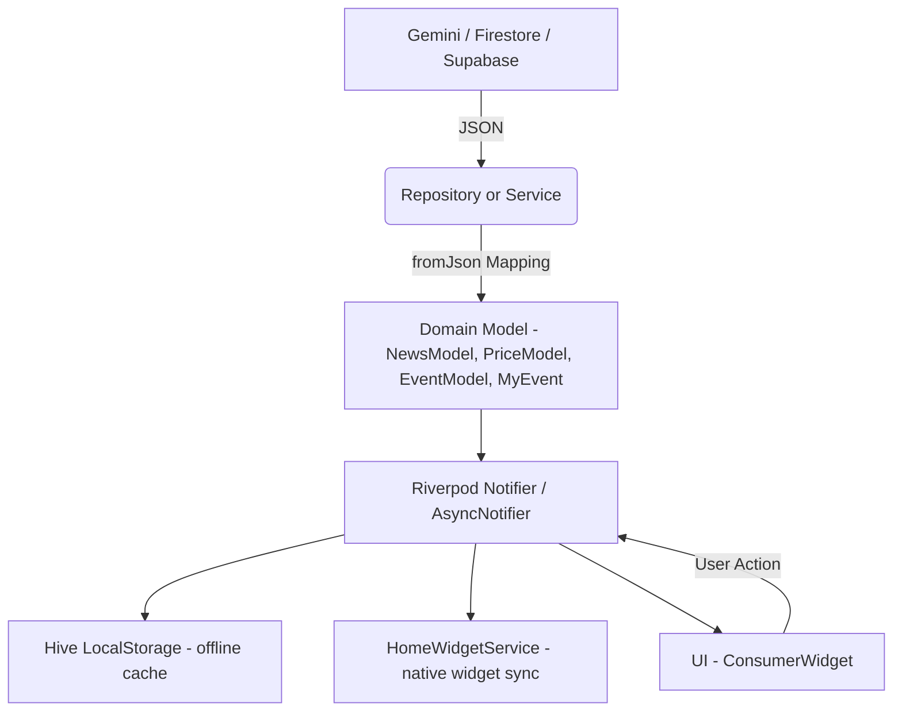

# Egy Calendar 📅
**Egypt's Events, News & Commodity Price Tracker**
_A Flutter app with AI-assisted content authoring, a synced home-screen widget, and a feature-first architecture._

---

[](https://flutter.dev/)
[](https://dart.dev/)
[](https://riverpod.dev/)
[-purple)](https://ai.google.dev/)
[](https://firebase.google.com/)

---

## 🚀 Core Features

- **Events**
  - Browse officially-announced Egyptian events by category/section (`features/events`)
  - **My Events**: personal events & categories with reminders, countdown timers, and swipe actions (`features/my_events`)

- **News & Commodity Prices**
  - Bilingual (Arabic/English) news feed and live gold/steel/cement/currency price tracking (`features/news`, `features/price`)

- **AI-Assisted Content Authoring**
  - An in-app admin dashboard uses `GeminiService` + `UniversalAIProcessor` to generate strictly-validated, Egypt-specific events/news/prices as JSON, which editors review before publishing to Firestore

- **Home Screen Widget Sync**
  - `HomeWidgetService` pushes events, news, prices, and "my events" to native Android/iOS home-screen widgets via an app group (`lib/helpers/home_widget_helper.dart`)

- **Auth & Deep Linking**
  - Firebase Auth with Google Sign-In
  - `DeepLinkHelper` routes notification taps and shared links straight to the relevant event/news/price details screen, even from a cold start

- **Notifications**
  - Local reminders via `flutter_local_notifications` (exact-alarm aware on Android 13+) and push notifications via Firebase Cloud Messaging

- **Responsive, Multi-Platform Routing**
  - `go_router` with dedicated routing configurations for mobile, iPad, and web (`core/router/mobile`, `core/router/ipad`, `core/router/web`)

---

## 🏗️ Feature-First Architecture

Egy Calendar is built on a **feature-first, layered architecture** for maximum scalability and maintainability.

### Directory Structure (lib/)

```text
lib/
│
├── core/                 # Shared utilities, services, and abstractions
│   ├── constants/        # App-wide constants & enums (incl. Firestore collection keys)
│   ├── enums/
│   ├── helper/           # help_functions, deep_link_helper, etc.
│   ├── local_services/   # Hive-backed local storage
│   ├── notifications/    # Local & remote (FCM) notification services
│   ├── remote_services/  # Dio client, API result/exception wrappers
│   ├── repositories/
│   ├── router/           # mobile/ipad/web GoRouter configs + dialog routes
│   ├── services/         # gemini_service, supabase, life_cycle, upload_image
│   └── widgets/
│
├── helpers/
│   └── home_widget_helper.dart   # HomeWidgetService (native widget sync)
│
├── features/             # Each feature is a self-contained module
│   ├── splash/
│   ├── onboarding/
│   ├── auth/              # Login encouragement dialog, shared auth widgets
│   ├── login/             # Firebase Auth + Google Sign-In, user repository
│   ├── main_page/         # Bottom-nav shell
│   ├── dashboard/         # Content/AI admin panel (news, price, event, category, section CRUD + AI generation)
│   ├── events/            # Public, curated Egyptian events
│   ├── my_events/         # User's personal events & categories (reminders, countdowns)
│   ├── news/
│   ├── price/
│   ├── add_edit_category/
│   └── settings/          # Profile, categories, legal pages, app settings
│
│   # each feature follows: data/ (models, providers, repositories) · presentation/ (UI)
│
└── main.dart              # App entry, root providers, router bootstrap
```

### Layered Separation

- **data/**: Models, Riverpod providers (often code-generated via `riverpod_generator`), and repositories (Firestore/Supabase/local)
- **presentation/**: UI widgets, screens, and `ConsumerWidget`/`ConsumerStatefulWidget` state consumers

**Relationship:**
> `core/` provides shared services and abstractions. Each `features/` module is isolated, with its own data/presentation layers, and communicates via Riverpod providers and shared core services.

---

## 🤖 AI-Assisted Content: GeminiService & UniversalAIProcessor

### Role
`GeminiService` (`lib/core/services/gemini_service.dart`) wraps the [`flutter_gemini`](https://github.com/AkhmadRamadani/flutter_gemini) package and is the single integration point for Gemini. `UniversalAIProcessor` (`lib/features/dashboard/presentation/universal_ai_proccessor.dart`) is the dashboard UI that drives it, used to **author** events, news, and price content that is then reviewed and published.

### How It Works

1. **Runtime API key:**
   - The Gemini API key is fetched from a Firestore collection (`Constants.gemini`) and used to call `Gemini.init(apiKey: ...)` right before each request — it is not hardcoded in the app.

2. **Strict JSON Prompting:**
   - Each use case (`generateMultipleEvents`, `generateMultipleNews`, `generateMultiplePrices`) sends a detailed, rule-heavy prompt to `gemini-2.5-flash` demanding Egypt-only, officially-verifiable content in a specific JSON shape, with explicit rules for dates, language (Arabic + English), and nullability of unverifiable fields (e.g. images).

3. **Mapping Gemini Output:**
   - The raw response is stripped of Markdown code fences, `jsonDecode`d, and mapped through each model's `fromJson` factory:
     ```dart
     final events = (jsonDecode(rawJson) as List)
         .map((e) => EventModel.fromJson(e))
         .toList();
     ```
   - Parsing failures are caught and logged; the caller gets an empty list rather than a crash.

4. **Editorial flow:**
   - `UniversalAIProcessor` renders the generated items as selectable `UniversalCard`s so an editor can review and publish only the items they approve, writing them into Firestore via the feature's own provider.

---

## 🔄 State Management Flow (Riverpod)

Egy Calendar uses **Riverpod 3** (with `riverpod_generator`/`riverpod_annotation` code generation) for reactive state management across all features.

### Data Lifecycle



### Example: News provider (`features/news/data/providers/news.dart`)

- **Notifier** fetches data from Firestore and/or Hive-backed local storage.
- **fromJson** mapping ensures type safety and model integrity.
- **State** is exposed as `AsyncValue<...>` for UI reactivity.
- **UI** listens to provider changes and updates instantly; relevant data is also pushed to the home-screen widget.

---

## 🧩 Home Screen Widget Sync

`HomeWidgetService` (`lib/helpers/home_widget_helper.dart`) keeps native Android/iOS home-screen widgets in sync with in-app data via the [`home_widget`](https://pub.dev/packages/home_widget) package:

- Shares data through an App Group (`group.com.egy_calender`)
- Supports `news`, `prices`, `events`, and `myEvents` payloads (`WidgetDataType`)
- Calls `HomeWidget.updateWidget` against the Android receiver (`EgyCalendarWidgetReceiver`) and iOS widget (`EgyCalendarWidget`) whenever the underlying data changes

---

## 🔔 Notifications & Deep Linking

### Local Notifications (`LocalNotificationsService`)

- Initializes timezones, requests notification permissions, and checks/requests the Android 13+ exact-alarm permission (`canScheduleExactNotifications` / `requestExactAlarmsPermission`) on startup.
- `schedule()` uses `AndroidScheduleMode.exactAllowWhileIdle` for one-off reminders and `periodic()` uses `inexactAllowWhileIdle` for repeating ones.
- Tapping a notification (foreground, background, or cold start) is routed through `DeepLinkHelper`.

### Deep Linking (`DeepLinkHelper`)

- Decodes a JSON payload (`{ "id": ..., "page": ... }`) from a notification or shared URL.
- If the app hasn't finished its splash/init flow yet, it stashes the pending payload and replays it once ready.
- Routes to the matching details screen: `myEvents`, `events`, `news`, or price details, via the mobile `GoRouter` instance.

### Remote Notifications

- Firebase Cloud Messaging is initialized alongside local notifications (`core/notifications/remote_notifications_service.dart`, `notification_initializer.dart`).

---

## 🔐 Auth

- Firebase Authentication with **Google Sign-In** (`google_sign_in` 7.x) on mobile and `signInWithPopup` on web (`features/login/data/providers/auth.dart`).
- User profile data is persisted through `UserRepository` on top of Firestore.

---

## 🛠 Tech Stack

| Technology                | Package / Usage                                   |
|----------------------------|-----------------------------------------------------|
| Flutter SDK / Dart         | SDK constraint `^3.7.0`                              |
| State Management           | `flutter_riverpod` 3, `riverpod_generator`           |
| Routing                    | `go_router` (adaptive mobile/iPad/web configs)       |
| AI Integration              | `flutter_gemini` via `GeminiService` (Gemini 2.5 Flash) |
| Auth                        | `firebase_auth`, `google_sign_in`                    |
| Backend / Data              | `cloud_firestore`, `supabase_flutter`                |
| Push Notifications          | `firebase_messaging`                                  |
| Local Notifications & Alarms| `flutter_local_notifications`, `timezone`             |
| Local Caching               | `hive_flutter`                                        |
| Home Screen Widget          | `home_widget`                                          |
| Networking                  | `dio`                                                   |
| Localization                | `easy_localization`, `intl`                             |
| Images                      | `cached_network_image`, `image_picker`, `flutter_image_compress` |

---

## ⚙️ Android & iOS Configuration Notes

- **Exact Alarms (Android 13+):**
  - `SCHEDULE_EXACT_ALARM` permission in `AndroidManifest.xml`.
  - Runtime check/request via `LocalNotificationsService._checkAndRequestExactAlarm()`.
- **Notification Channel:**
  - `high_importance_channel` is configured for high-priority alerts.
- **Google Sign-In (iOS):**
  - Requires `GoogleService-Info.plist` in `ios/Runner/`, plus a matching `CFBundleURLTypes` reversed-client-ID URL scheme and `GIDClientID` entry in `Info.plist`.
- **Home Screen Widget:**
  - Requires a matching App Group (`group.com.egy_calender`) and native receiver/widget targets (`EgyCalendarWidgetReceiver` on Android, `EgyCalendarWidget` on iOS).

---

## 🏗 Setup

1. **Clone the Repository**
   ```sh
   git clone https://github.com/mostafa-shridam/egy-calender.git
   cd egy-calender
   ```
2. **Install Dependencies**
   ```sh
   flutter pub get
   ```
3. **Configure secrets (required for a working local build)**
   - Copy `lib/core/config/secrets.example.dart` to `lib/core/config/secrets.dart`.
   - Fill in your API base URL and the Supabase **anon / publishable** key (never the `service_role` key).
   - Firebase client files (`google-services.json`, `GoogleService-Info.plist`, `lib/firebase_options.dart`) are already in the repo and are public client config.
   - Store a Gemini API key in the Firestore collection read by `GeminiService` (`Constants.gemini`). Protect that collection with Firestore Security Rules so it is not world-readable.
4. **Run the App**
   ```sh
   flutter run
   ```
5. **Android: Enable Exact Alarms**
   - Ensure the device grants the `SCHEDULE_EXACT_ALARM` permission for full reminder functionality.

---

## 📢 Notes

- **Localization:**
  - All strings and dates are localized (see `assets/translations/`).
- **AI Features:**
  - Requires a valid Gemini API key (fetched from Firestore at runtime, not bundled with the app).
- **Testing:**
  - Widget and integration tests are in the `test/` directory.

---

**Built with ❤️ for Egypt.**
_Contributions and feedback are welcome!_
